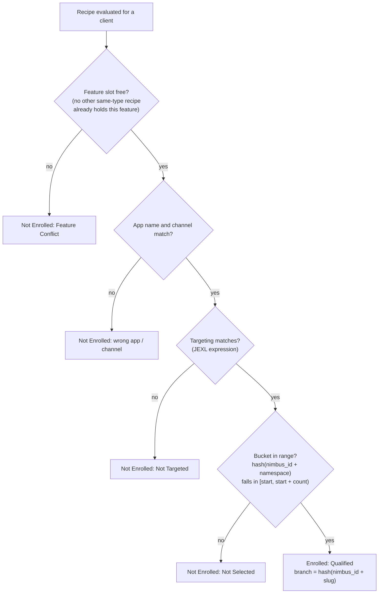
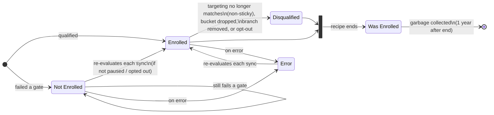
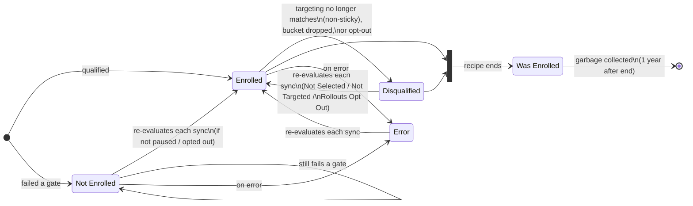

How the Nimbus client decides, on every sync, whether a client is enrolled in a recipe, which states an enrollment can be in, and what a change to a live recipe does to clients already evaluated against it.

:::info scope
This page covers both Nimbus clients:

- The **mobile SDK**: the shared Rust client used by Firefox for Android, Firefox for iOS, and Cirrus.
- The **desktop client**: the separate JS implementation in Firefox Desktop.

They are distinct codebases that implement the same model, and recent desktop work has brought them closer in line. Everything below applies to both unless a **Desktop / mobile difference** callout says otherwise, and the specific divergences are collected in [Where the two clients differ](#where-the-two-clients-differ).
:::

## When enrollment is evaluated

Enrollment is not decided once. Every time the client syncs recipes from Remote Settings and applies them, it re-evaluates every recipe it currently knows about against the current client state. "Knows about" means both the recipes in the latest published list and the enrollment records the client has stored from previous syncs.

The practical consequence: a client's status for a recipe can change on any sync, in either direction, without the client doing anything. A client that lost the bucketing roll yesterday can enroll today if a rollout was resized, and a client enrolled today can unenroll tomorrow if one of its targeting attributes drifts out of range (and the recipe is not sticky). There is no "decided once and frozen" state for a live recipe (the one exception is a recipe that has ended, covered under [Was Enrolled](#was-enrolled)).

## The evaluation sequence

For a single client and a single recipe, the client works through these gates in order. The first gate that fails determines the Not Enrolled reason; a gate is only reached if every earlier gate passed.



Two points that this ordering makes concrete:

- **Targeting and bucketing are independent gates, checked in that order.** Targeting decides whether a client is _eligible_. Bucketing decides whether an eligible client is _selected_ by the current population size. A client can pass targeting and still be Not Selected, and changing one gate does not change the other.
- **The feature-conflict gate only blocks _new_ enrollments.** A client already enrolled in a recipe holds that feature slot going into the sync, so it is evaluated before any competing recipe can claim the feature. When two recipes of the same type contend for a free slot, they are evaluated in published-date order, so the earlier-published recipe wins deterministically (every client resolves the conflict the same way). Experiments and rollouts have separate slots, so an experiment and a rollout can both hold the same feature at once.

## What persists across evaluations

Because evaluation re-runs every sync, the interesting question is what stays fixed and what is recomputed. The distinction is what lets you reason about a recipe edit.

| Thing | Stable or recomputed | Detail |
|---|---|---|
| `nimbus_id` | **Stable** for the life of the profile | Generated on first run and stored in the Nimbus DB. It is the input to every hash, so bucketing and branch assignment are deterministic and repeatable for a given client. |
| Bucket membership | **Recomputed every sync** (see difference below) | `hash(nimbus_id + namespace)` is stable, but membership is that hash tested against `[start, start + count)`. Moving `count` moves the boundary, so the same client flips in or out when the recipe is resized. For a not-yet-enrolled client this is recomputed on both clients. For an *already-enrolled* client, the mobile SDK recomputes it for experiments and rollouts, while desktop recomputes it only for rollouts (desktop treats an active experiment's bucket as fixed). |
| Branch assignment | **Stable once enrolled** | `hash(nimbus_id + slug)` is deterministic. Once a client is Enrolled, its branch is pinned and is never re-rolled while it stays enrolled, even across re-evaluations. |
| Enrollment record | **Re-evaluated each sync** | A live recipe's status is recomputed from scratch on every sync, not read from a cached decision. (The mobile SDK persists a record for not-enrolled recipes too; desktop stores nothing for a client that failed to enroll and simply re-evaluates the recipe next sync. Same outcome.) |
| `Was Enrolled` record | **Kept for 1 year, then garbage collected** | Set when a recipe the client was enrolled in ends. It preserves the branch so prior-enrollment targeting (`enrollments`, `enrollmentsMap`) keeps working. Deleted 365 days after the recipe ended. |

The headline: **the only inputs pinned per client are `nimbus_id` and (once enrolled) the branch. Everything the recipe controls, including targeting and the bucket boundary, is re-read from the current recipe on every sync.**

## Enrollment states and reasons

Each state has a "reason" that acts as a sub-state. The `Enrolled`, `Not Enrolled`, and `Disqualified` states below are re-evaluatable while the recipe is live; `Was Enrolled` is the terminal state for a recipe that has ended.

### Enrolled

The client is receiving the recipe's configuration.

- **Qualified**: the client passed the feature, targeting, and bucketing gates<sup><a href="#notes">[1]</a></sup>.
- **Opt In**: the client explicitly opted into this recipe<sup><a href="#notes">[2]</a></sup>. An opt-in enrollment is not re-evaluated against targeting or bucketing.

### Not Enrolled

The client has never been enrolled in this recipe. These reasons are re-evaluated on every sync, so a Not Enrolled client can become Enrolled on a later sync if the recipe changes.

- **Not Selected**: the client passed targeting but its bucket is not in the recipe's current range. **This is the reason a rollout resize acts on: raising a rollout's `count` re-selects clients that were previously Not Selected.**
- **Not Targeted**: the client did not match the targeting expression.
- **Opt Out**: the client has opted out of experimentation at the application level.
- **EnrollmentsPaused**: the recipe has paused enrollments, so no new clients enroll (existing enrollments are unaffected).
- **Feature Conflict**: another recipe of the same type, which the client is already enrolled in, holds one of this recipe's features<sup><a href="#notes">[3]</a></sup>, and the feature is not enabled for coenrollment.

### Disqualified

The client was previously in an `Enrolled` state and has been dropped. Whether a Disqualified client can re-enroll depends on the recipe type (see [Rollouts vs experiments](#rollouts-vs-experiments)).

- **Not Targeted**: an enrolled client no longer matches targeting (only reachable when the recipe is _not_ using sticky enrollment).
- **Not Selected**: an enrolled client's bucket is no longer in range, e.g. the recipe was scaled back.
- **Opt Out**: the client opted out of the recipe, or globally opted out of studies<sup><a href="#notes">[2]</a></sup>.
- **Error**: the client threw an error during enrollment re-evaluation.

### Was Enrolled

The recipe has ended (disappeared from the published list). Clients that were `Enrolled` or `Disqualified` transition here. The record keeps the client's branch so prior-enrollment targeting still resolves, and is garbage collected 365 days after the recipe ended.

### Error

The client threw an error while evaluating a recipe it had never been enrolled in<sup><a href="#notes">[4]</a></sup>.

:::note Desktop / mobile difference
The states above (`Enrolled`, `Not Enrolled`, `Disqualified`, `Was Enrolled`, `Error`) are identical on both clients. Desktop reports a **superset of reasons**: in addition to the ones above it emits `OptIn`, `ChangedPref`, `ForceEnrollment`, `NameConflict`, `PrefFlipsConflict`, `UnenrolledInAnotherProfile`, and `Migration`, which cover desktop-only mechanics (pref-flip conflicts, about:config pref changes, Firefox Labs opt-ins, cross-profile coordination, and store migrations).
:::

## State diagrams

The following diagrams describe the transitions on both clients. The two recipe types differ only in the re-enrollment edge out of `Disqualified`.

### Experiments

An experiment client that is disqualified stays disqualified for the life of the recipe. This protects analysis: a client that left an experiment does not silently rejoin and pollute the branch it was measured in.



### Rollouts

A rollout is a delivery mechanism, not a measurement, so it is allowed to re-enroll a disqualified client. A client dropped when a rollout scaled back (Disqualified: Not Selected) rejoins if the rollout scales up again, and a client dropped by an opt-out rejoins if the user opts back in.



## Sticky enrollment

Sticky enrollment changes **one thing**: for a client that is _already enrolled_, targeting is skipped on re-evaluation so the client is not unenrolled when a targeting attribute drifts (a profile ages past "new user", a pref changes, a feature gets used). It is implemented by wrapping the sticky part of the targeting expression so it short-circuits to true for enrolled clients:

```
(<already-enrolled check>) || (<original targeting expression>)
```

The already-enrolled check is true only for a client whose stored status is one of the Enrolled states. For every other client it is false, so the original expression is evaluated normally.

:::note Desktop / mobile difference
The two clients realize the already-enrolled check differently, with the same effect:

- **Mobile SDK**: the SDK injects an `is_already_enrolled` value and the clause reads `(is_already_enrolled) || (...)`.
- **Desktop**: there is no injected variable and the client evaluates the recipe's raw targeting unchanged. Instead the client exposes enrollment-membership arrays in the targeting context (`activeExperiments`, `activeRollouts`, `enrollments`, `enrollmentsMap`, `previousExperiments`, `previousRollouts`), and the recipe references them, e.g. `('slug' in activeExperiments) || (...)`.

The difference is only where the wrap lives; the behavior is equivalent.
:::

What sticky enrollment does **not** do:

- It does **not** affect bucketing. The already-enrolled check only gates targeting; the bucketing gate runs on every evaluation regardless. Resizing a recipe re-selects clients whether or not it is sticky.
- It does **not** keep Not Selected (or Not Targeted, or any Not Enrolled) clients out. Those clients are not enrolled, so the already-enrolled check is false for them, and they are re-evaluated from scratch each sync.
- It does **not** lock enrollment. It only removes the targeting drift as a reason to unenroll; an enrolled client can still be dropped by a bucket resize, a removed branch, or an opt-out.

In short, sticky enrollment is an unenrollment-prevention mechanism on the targeting gate for enrolled clients. It has no bearing on which clients a resize captures.

## Rollouts vs experiments

Both types run through the same gates and the same states. The differences that matter for reasoning about live changes:

- **Re-enrollment after disqualification.** A disqualified _rollout_ client re-enrolls when it would qualify again (bucket back in range, targeting matches again, or opt back in). A disqualified _experiment_ client does not; it stays out for the life of the recipe to keep analysis clean.
- **Sticky default.** Experiments commonly use sticky enrollment (and it is auto-selected for targeting configs that require it, such as new-user targeting). Rollouts generally do not need it, since re-enrollment is allowed anyway.
- **Feature slots are separate.** A client can hold one experiment and one rollout on the same feature at once, so an experiment and a rollout do not conflict with each other.

## What changes when you edit a live recipe

Most of a recipe is fixed at launch. Experimenter only lets you make three kinds of change to a live recipe:

- **Resize a rollout's population** (raise or lower `count`) while it is still enrolling.
- **End enrollment** early, so the recipe stops taking new clients but keeps serving current ones.
- **End the recipe.**

Targeting, channel, version range, branches, and branch feature values are **locked once the recipe is live**. To change any of them you clone the recipe into a new one; the clone gets a new slug and namespace, so every client evaluates it from scratch. A live **experiment** cannot be edited at all, not even its population; only **rollouts** are resizable. Cloning, not editing, is how you change a live recipe's targeting or configuration.

Each row below is what happens on clients' next sync after the change. "Next sync" is typically within a day for most of the population and a few days for the long tail, gated only by how quickly clients fetch Remote Settings and re-evaluate.

| Change | Clients not yet enrolled | Clients already enrolled |
|---|---|---|
| **Increase a rollout's population %** (raise `count`) | Clients whose bucket now falls in range enroll (Not Selected → Enrolled), including clients previously dropped as Disqualified: Not Selected. This is how a resize reaches more clients. | No change; they stay enrolled on their pinned branch. |
| **Decrease a rollout's population %** (lower `count`) | No change; still out. | Clients whose bucket is now outside the range are dropped (Enrolled → Disqualified: Not Selected). They rejoin if the rollout is later scaled back up. |
| **End enrollment early** | No new enrollments (Not Enrolled: EnrollmentsPaused). | No change; existing enrollments continue until the recipe ends. |
| **End the recipe** (unpublish) | Their record is dropped. | Move to Was Enrolled (branch retained for prior-enrollment targeting, feature slot freed), garbage collected after 1 year. |
| **Clone into a new recipe** (to change targeting, branches, or feature values) | Evaluated against the new recipe from scratch. | Evaluated against the new recipe from scratch under its new slug and namespace. Enrollment in the original is untouched, so if the clone targets the same feature and type as the still-live original, clients already in the original block on Feature Conflict until the original ends. |

### Changes that come from the client, not the recipe

Some transitions look like recipe edits but are driven by the client's own state changing between syncs, since the recipe's targeting and configuration cannot change while live:

- **A targeting attribute drifts** (the profile ages past a "new user" window, a pref changes, a feature gets used). On the next sync the recipe's targeting is re-evaluated against the new attribute value. An enrolled client is dropped (Enrolled → Disqualified: Not Targeted) unless the recipe is sticky, in which case it stays. A not-yet-enrolled client that now matches can enroll (subject to bucketing). This is the real mechanism behind "the audience changed."
- **The user opts out of studies.** Enrolled clients are dropped (Enrolled → Disqualified: Opt Out). For rollouts, opting back in re-enrolls; for experiments it does not. Not-yet-enrolled clients stay out while opted out.

## Where the two clients differ

The mobile SDK and the desktop client implement the same model, and the states, gates, sticky semantics, feature-conflict resolution, branch pinning, and the whole [what changes when](#what-changes-when-you-edit-a-live-recipe) table behave the same on both. The differences are:

| Aspect | Mobile SDK | Desktop |
|---|---|---|
| Sticky implementation | Injects an `is_already_enrolled` value; clause reads `(is_already_enrolled) \|\| (...)` | No injected variable; exposes membership arrays (`activeExperiments`, `enrollments`, etc.) that the recipe references, e.g. `('slug' in activeExperiments) \|\| (...)`. Same effect. |
| Re-bucketing an already-enrolled client | Re-buckets experiments and rollouts | Re-buckets rollouts only; an active experiment's bucket is treated as fixed |
| `Was Enrolled` retention | Garbage collected 365 days after the recipe ends | Garbage collected 365.25 days after the recipe ends |
| Reason vocabulary | Core reasons only | Superset (adds `OptIn`, `ChangedPref`, `ForceEnrollment`, `NameConflict`, `PrefFlipsConflict`, `UnenrolledInAnotherProfile`, `Migration`) |
| Cross-profile coordination | None | Unenrolling a recipe in one profile can unenroll it in the machine's other profiles (`UnenrolledInAnotherProfile`); no SDK equivalent |
| Re-evaluation cadence | On the app's sync schedule (startup / foreground) | On a timer (default 6 hours) plus startup and pref changes |

The re-bucketing difference only matters if a live recipe's population changes, which Experimenter allows only for rollouts (both clients re-bucket rollouts), so it is not reachable for experiments through the normal flow. Two of the rows above are the product of recent desktop work to converge on the SDK: re-enrollment into ended/disqualified rollouts, and evaluating rollouts before experiments so contested feature slots resolve the same way. The codebases remain separate, so treat this table as current behavior rather than a permanent contract.

## Notes

1. The order in which a recipe's gates are evaluated for a client:
    1. Feature conflicts (only blocks new enrollments; an already-enrolled client holds its slot)
    2. App name and channel availability
    3. Targeting
    4. Bucketing
2. The Opt In enrolled state is reached through opt-in surfaces (Firefox mobile's secret menu, desktop Firefox Labs). A manual opt-out disqualifies the client.
3. Experiments and rollouts do not share feature conflicts. A client can be enrolled in up to one rollout and one experiment for a given feature, unless that feature has been enabled for coenrollment.
4. The `Error` state only holds recipes the client has never been enrolled in. If an enrolled client throws an error during re-evaluation it moves to [Disqualified: Error](#disqualified) instead.
