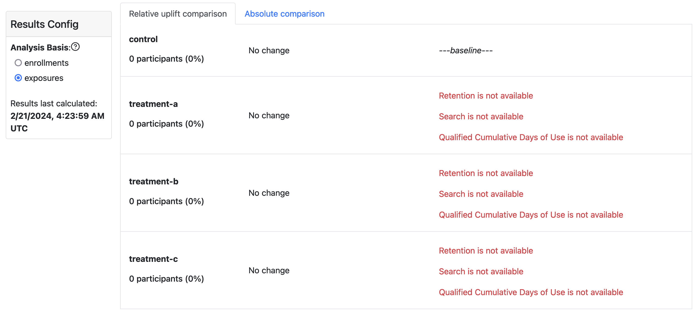
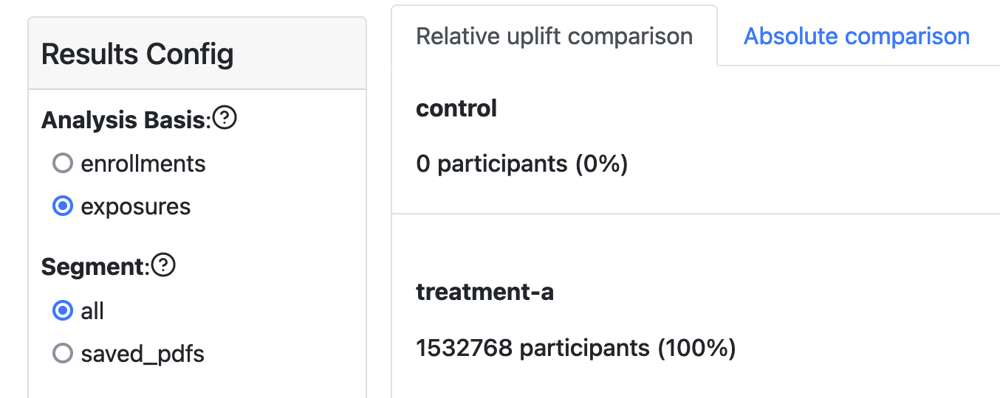

In a Nimbus experiment, not every enrolled client actually experiences the experimental intervention or treatment. We refer to "experiencing the experimental treatment" as `exposure`. For example, in a messaging experiment, some enrolled users do not meet the conditions to be shown the message. As another example, some experimental treatments require the user to restart their browser to take effect, so users who do not restart do not experience the treatment. Calculating results based on all enrolled users, when many users are not exposed, results in a _diluted estimate of the treatment impact_. For the highest precision, experiments should be configured with an _Exposure Signal_, which allows the analysis system to determine which enrolled users were exposed.

If you see missing results like those shown in the image below, then

1. The client did not call Nimbus's record exposure API ([desktop](../../getting-started/engineers/desktop-feature-api.mdx#recordexposureevent) and [mobile](../../deep-dives/specifications/fml/fml-spec.mdx#recording-exposure)).
2. A `ExposureSignal` was not defined in this experiment's [custom analysis configuration](../jetstream/configuration.md#defining-exposure-signals).

# Configuring experiments for exposure-based analysis

## Configuring exposures post-hoc

If the experiment is live or finished, then the only option is to define an `ExposureSignal` as a custom config (see point 2 above). In this approach, we tell the automated analysis system which telemetry probe represents exposure for this experiment. Note that this must be a telemetry probe that was collected while the experiment was live. For assistance with this step, contact your supporting data scientist through the experiment's DS Jira ticket or ask in [#ask-experimenter](https://mozilla.slack.com/archives/CF94YGE03).

:::warning Dangers with custom signals
Exposure is the point in time _immediately prior_ to recieving the treatment. We cannot use any post-treatment telemetry as the definition of exposure as that risks creating a biased comparison and results in non-causal inference. For example, an experiment in which the treatment gets a message to suggest using a new feature. In that experiment, exposure is _being shown a message_ (treatment branch) or _would have been shown a message_ (control branch). Exposure **is not** _using the new feature_. If we compare users who used the feature we'll be comparing users who discovered the feature organically (control branch) against a treatment branch containing organic discoverers and users who tried the feature out as a result of seeing the message.
:::

### What if no telemetry exists which can be proxied for exposure?

In that case, fall back on enrollments-based analysis (click the `enrollments` radio button in the Analysis Basis selector) and see the [section on interpretation discussion](#enrollments-vs-exposures-analysis) below. Additionally, aim to have future experiments configured for exposures-based analysis.

## Preparing future experiments for exposure-based analysis

For experiments that have not yet launched, it is preferred to implement exposures client-side by calling the appropriate method from the Nimbus SDK (see point 1 above). Once implemented, these events will get picked up by the automated analysis system, so no custom analysis configuration is required.

:::info Common mistake: exposures missing in control branches
It is important to record exposures events in all treatment branches. Sometimes, this can be complex to do for a control group where the exposure is a lack of intervention. For example, a control group that does not get a new feature or does not get a message. In this case, we need to record telemetry _at the point in time the users would have received the intervention but for the fact that they were allocated to the control group_. In the message case, we need the messaging system to record an event that a message _would have been shown_ but for the system to also not actually show the message.
:::

An example of an experiment that has exposure events only for the treatment branch, and thus cannot do exposure-based analysis:

# Enrollments vs Exposures analysis

**Exposures** based analysis measures the experiment's impact _among users who recieved the treatment_. This is the most precise and statistically powerful comparison and as a result, the comparison with the _**highest probability of measuring an impact**_.

**Enrollments** based analysis measures the experiment's impact _among all users who met the targeting_. This can be a diluted measurement, more akin to asking the question "what would we see if we shipped this branch out to the broader population"?

For example, suppose an experiment enrolling 1m users has a 10% exposure rate (10% of enrolled users are exposed to the treatment) and the true treatment impact (relative lift) among exposed users is 10%. In an ideal case (ignoring statistical issues like noise) we would expect to see results like:

- Exposures: 100k exposed users, 10% relative lift (stat sig).
- Enrollments: 1m enrolled users, 1% relative lift (stat sig).
  However, since statistical noise is present, there's a possibility that the noise in the enrollments analysis overwhelms the small signal and so that analysis winds up being _not statistically significant_. That is, the enrollments-based analysis fails to measure any impact at all.
