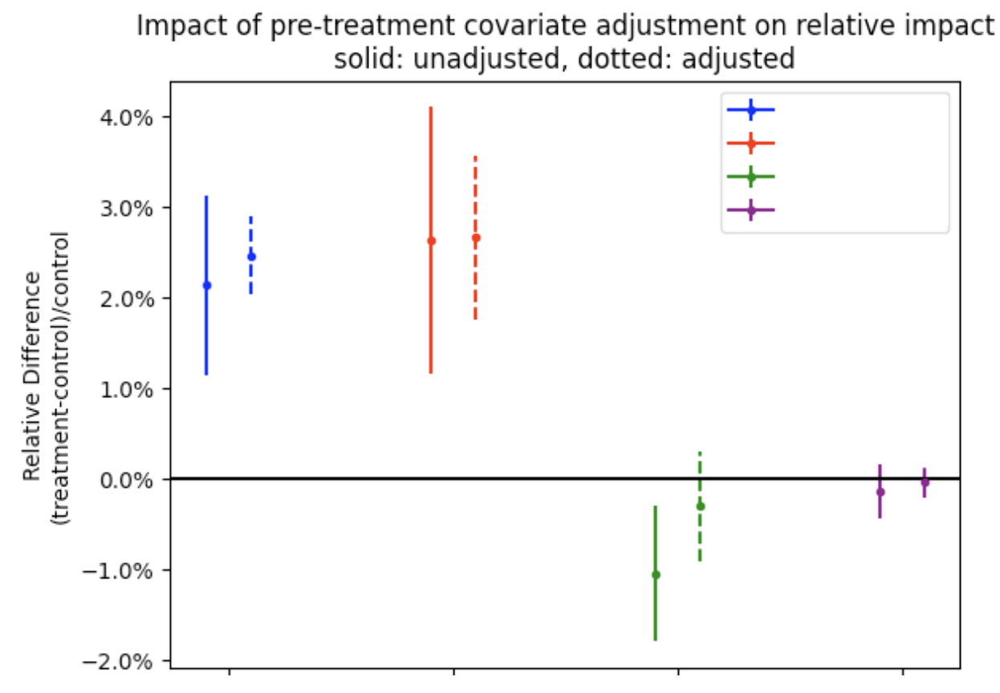

# Automatically Countering Preenrollment Bias

TL;DR: Nimbus has the capability to adjust metrics to account for preenrollment bias/natural randomization variability and to improve the precision of inferences, when possible. Currently this is configured by default for guardrails (averages only) but can also be used for custom analyses. This is expected to reduce the frequency of false positives, of which we believe many were caused by natural randomization variability.

## Preenrollment Bias

In order to generate evidence for a causal hypothesis, we must guarantee that all sources of [confounding](https://en.wikipedia.org/wiki/Confounding) are accounted for. We can either do this by manually controlling for all confounders (which is quite difficult), or we can use randomized experiments in which the randomization process guarantees that, _on average_, units in each treatment branch are balanced on all confounders.

Randomization provides a guarantee of balance on average and across large numbers of experiments, but in practice, for any given experiment and confounding dimension there is the possibility of imbalance. This imbalance (or rather, confounding) presents a challenge to our goal of gathering causal evidence. An imbalance observed during the treatment period is indistinguishable from a treatment effect. In the next section (Retrospective A/A Tests) we provide a method for detecting these situations.

## Retrospective A/A tests

User behavior tends to be consistent over time. We've found week-to-week correlations of up to 80% for our key guardrail metrics. Given this strong correlation, we can look for evidence of imbalance during the _pre-experiment period_. We've been using the term preenrollment bias, though [others](https://www.statsig.com/blog/pre-experiment-bias-detection-statsig) use pre-experiment bias.

During the pre-experiment period, our experimental cohorts should have no statistically significant difference across the dimensions (metrics) of interest. If there are statistically significant differences during the pre-experiment period, this is evidence of bias. This technique is called a [Retrospective A/A test](https://www.microsoft.com/en-us/research/articles/patterns-of-trustworthy-experimentation-pre-experiment-stage/).

We now automatically run Retrospective A/A tests for all Nimbus experiments to test for imbalance in guardrail metrics. These can be found alongside the other statistical results in the [Jetstream data products](https://docs.telemetry.mozilla.org/datasets/jetstream.html#statistics-tables).

In short, you can find them in the `moz-fx-data-experiments.mozanalysis.statistics_<slug>_<period>_1` where `<slug>` is the (snake case) experiment slug or ID (can be found using the Experimenter UI). We run analyses over 2 periods: the week prior to enrollment (`<period>` = `preenrollment_week`) and the 28-day period prior (`<period>` = `preenrollment_days_28`).

For example:

```sql
SELECT *
FROM `moz-fx-data-experiments.mozanalysis.statistics_fake_experiment_slug_preenrollment_week_1`
WHERE 1=1
  AND comparison = 'relative_uplift'
  AND comparison_to_branch = 'control'
  AND statistic != 'deciles'
  AND analysis_basis = 'exposures'
ORDER BY metric, branch, statistic
```

## Covariate Adjustment & CUPED

What if the Retrospective A/A test flags evidence of an imbalance? Should we have to discard that metric from our analysis completely? Luckily, there exist techniques to adjust for pre-experiment information. The most common/popular of these is [CUPED](https://www.statsig.com/blog/cuped). We have implemented a CUPED-like technique using linear models.

Inferences for the [average treatment effect](https://en.wikipedia.org/wiki/Average_treatment_effect) (ATE) are most commonly calculated by computing the average (mean) in each treatment branch and then computing the difference. However, this can also be calculated using linear models.

As an example, we can fit a model of the form:

$$y_i = \beta_0 + \beta_t t_i$$

where $t_i$ is the treatment indicator (0 if control, 1 if treated) for the $i$-th unit. Inferences on the ATE can be found from the $\beta_t$ parameter. The point estimate and confidence interval will be identical ([ref](https://www.refsmmat.com/courses/727/lecture-notes/linear-models.html#sec-ols-framework)) to the point estimate and confidence interval of the absolute difference in means between the branches. Computing the confidence intervals for the relative differences are more complex, but can be done using post-estimation marginal effects ([ref](https://stats.stackexchange.com/questions/646454/inferences-on-ratio-of-branch-means-in-randomized-experiment/646462#646462)).

Using this framework, it's quite simple to extend our experiment analysis to account for pre-experiment data. We can simply include it as a covariate in the model. We can instead estimate:

$$y_i = \beta_0 + \beta_t t_i + \beta_y z_i$$

Where $z_i$ is the metric of interest ($y$) for the $i$-th unit as measured during the pre-experiment period. As before, we're interested in inferences to $\beta_t$, but now these inferences will be:

1. Adjusted to account for pre-experiment information
2. Benefit from an increase in precision.

### Configuring covariate adjustment

#### Adjusting a new metric for preenrollment bias

To perform adjustment for a new metric, you can write/edit the [custom config](../jetstream/configuration.md#custom-experiment-configurations) to do 2 things: 1) configure your metric to be calculated over the preenrollment period (that is, perform the retrospective A/A test) and 2) configure the adjustment.

To ensure that your metric is computed during the pre-enrollment period, simply add it to the desired period metric list:

```toml
preenrollment_weekly = [
    'my_new_metric'
]
```

To configure the adjustment, first designate that inferences on the mean are desired using linear models. Then, configure that statistic to adjust based on the period chosen above. For example:

```toml
[metrics.my_new_metric.statistics.linear_model_mean] # desire to estimate the mean using linear models
[metrics.my_new_metric.statistics.linear_model_mean.covariate_adjustment] # desire to adjust that estimate
period = "preenrollment_week" # adjust using the same metric calculated during the week prior to enrollment
```

One can reference how adjustment is configured for guardrails ([example](https://github.com/mozilla/metric-hub/blob/57cd56a2fee4ed441a172a7c6cfac10a45d3fb3e/jetstream/defaults/firefox_desktop.toml#L33-L67)).

:::note
Currently, the custom configs only support adjusting a during-treatment metric using the pre-experiment version of that metric. It's not supported to adjust a metric using a different metric or by using during-experiment data. To accomplish either of those tasks, you'll need to do so manually.
:::

:::info
As of February 2025, the execution order of analysis periods is not guaranteed. This means that, when rerunning an analysis for an experiment, it's possible for the computation for the during-treatment analysis to execute before the preenrollment has finished. This will result in the adjustment not being performed. That is, Jetstream will automatically fall back to unadjusted inferences. You can determine if Jetstream fell back by either examining the logs (see [dashboard](https://mozilla.cloud.looker.com/dashboards/246?Experiment=&Timestamp+Date=14+day&Log+Level=ERROR%2CWARNING)) or by comparing to the unadjusted confidence intervals (which will be identical if adjustment was not performed).
:::

#### Custom adjustments

We have built tooling to perform these calculations and these methods can be used manually by data scientists to perform custom adjusted inferences. For example, suppose one wanted to control for machine type (cores) in an experiment trying to drive performance.

```python
from mozanalysis.statistics.frequentist_stats.linear_models import compare_branches_lm

ref_branch = 'control'
df = ... # one row per experimental unit, with `branch`, `performance`, and `cores` as columns

output = compare_branches_lm(df, 'performance', covariate_col_label='cores')
```

To dig even deeper or for something more custom, we expose our own linear model class ([MozOLS](https://github.com/mozilla/mozanalysis/blob/main/src/mozanalysis/frequentist_stats/linear_models/classes.py)) which is optimized for analyzing experimental data as well as functions to extract absolute and relative confidence intervals ([usage example](https://github.com/mozilla/mozanalysis/blob/main/src/mozanalysis/frequentist_stats/linear_models/functions.py#L505-L526)).

:::warning
HERE BE DRAGONS. It's possible to accidentally leak during-experiment information when performing these custom analysis thus potentially invalidating any causal evidence. Similarly, confidence intervals may be incorrect or misleading for complex adjustments.
:::

## Impact and Effectiveness

The effectiveness of the correction varies with the design of the experiement. For example, onboarding experiments do not have pre-experiment data and as such no adjustment can be made. Adjustments are most effective when user behavior has strong temporal correlations. See [here](https://docs.google.com/document/d/19iyqEidsEOYCPxHWi-3azqtlEqXL-46pttJ2GA7jSW8/edit?tab=t.0) for an internal summary of the effectiveness of this methodology, but as a quick primer: we can see from the below experiment that adjusted inferences (dotted line) are more precise and powerful and can remove spurious false positives (green metric)


