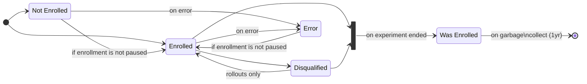

## Possible States

Within the Nimbus SDK there are multiple states, most of which have a "reason" associated with them.
The reason field functions as a child state, and is required for parent states that have reasons.

### Enrolled

#### Qualified

The client is not already enrolled in a recipe of the same type that would result in a feature conflict, and matched targeting and bucketing criteria for this recipe<a href="#notes">[1]</a>.

#### Opt In

The client explicitly opted into this recipe<a href="#notes">[2]</a>.

### Not Enrolled

:::info
This state and its reasons are for enrollments that have never been enrolled, and did not enroll.
:::

#### Not Selected

The client did not fall into the bucketing selected for this recipe.

#### Not Targeted

The client did not match the criteria set forth by the targeting string.

#### Opt Out

The client has opted out of experimentation at the application level.

#### EnrollmentsPaused

The recipe has paused enrollments.

#### Feature Conflict

The feature(s) the recipe targets a) are being experimented on by another recipe of the same type in which the client is already enrolled<a href="#notes">[3]</a>, and b) are not enabled for coenrollment.

### Disqualified

:::info
This state and its reasons are for enrollments that were previously in one of the `Enrolled` states, but are no longer enrolled.
:::

#### Not Targeted

_See [NotEnrolled::NotTargeted](#not-targeted)_

#### Not Selected

_See [NotEnrolled::NotSelected](#not-selected)_

#### Opt Out

The client manually opted out of the recipe<a href="#notes">[2]</a>.

#### Error

The client threw an error during enrollment re-evaluation.

### Was Enrolled

The recipe has ended, and the client was enrolled at some point.
The `Enrolled` and `Disqualified` statuses end up here when a recipe ends.

### Error

The client threw an error during enrollment evaluation<a href="#notes">[4]</a>.

### Notes

1. The explicit order in which recipe criteria are evaluated is as follows:
    1. Feature conflicts
    2. Targeting
    3. Bucketing
2. This state can be reached via Firefox mobile's secret menu.
3. Experiments and rollouts do not share feature conflicts.
   A client can be enrolled in up to one rollout and one experiment for a given feature, unless that feature has been enabled for coenrollment.
4. This status will only contain enrollments for recipes in which the client has never been enrolled.
   If the client is enrolled but throws an error during enrollment re-evaluation it will be moved to [Disqualified::Error](#error)

## State Diagrams

The following state diagrams describe the interactions between states for the enrollment state machine in the mobile Nimbus SDK.

### Experiments

