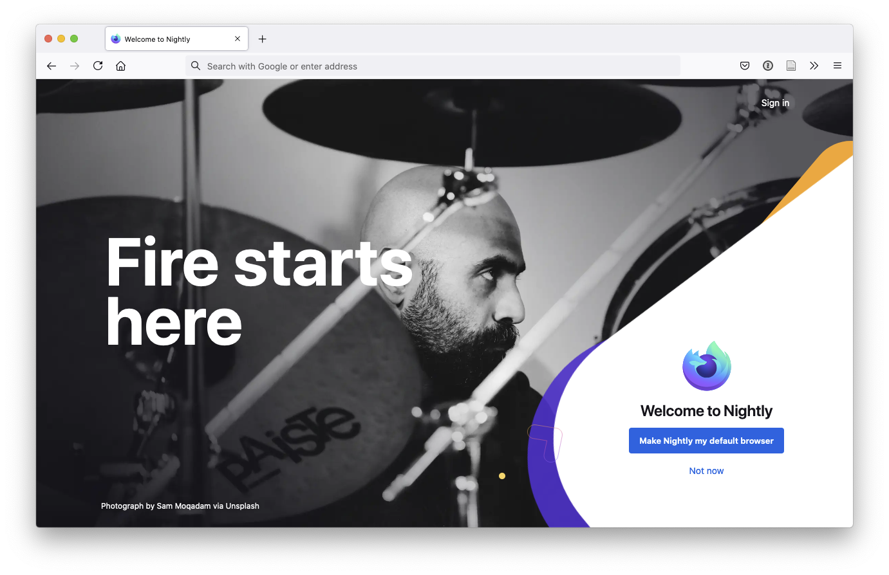
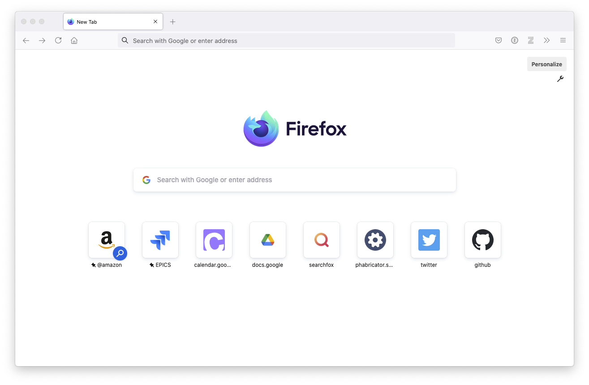

## Overview

This is the multi-stage onboarding experience for Firefox Desktop that shows up when people first install the browser.

- **ID**: `aboutwelcome`
- **Application**: Desktop

## Testing instructions

Visit `about:welcome` in your browser. You can set various fallback preferences (defined in the variables section) to test different variables.

## Variables

The following variables are configurable off-trains for aboutwelcome:

### `enabled`

- preference: `browser.aboutwelcome.enabled`
- type: `boolean`

| Value            | Description                                             |
| ---------------- | ------------------------------------------------------- |
| `true` (default) |     |
| `false`          |  |

### `isProton`

- preference: `browser.proton.enabled`
- type: `boolean`

| Value            | Description                                                                                                                                        |
| ---------------- | -------------------------------------------------------------------------------------------------------------------------------------------------- |
| `true` (default) |                                                                                    |
| `false`          | The new tab page will show up in place of about:welcome. |

### `background_url`

- preference: (none)
- type: `string`
- default value: `"chrome://activity-stream/content/data/content/assets/proton-bkg.webp"`

Sets the background image. Note that this variable is relevant only if [`isProton`](#isproton) is `true`.

### `screens`

- preference: `browser.aboutwelcome.screens`
- type: `json` (a list of screens)

This variable contains the json for an array of screen content, rendered in the order they are defined.

[TODO, add individual screen parameters]
