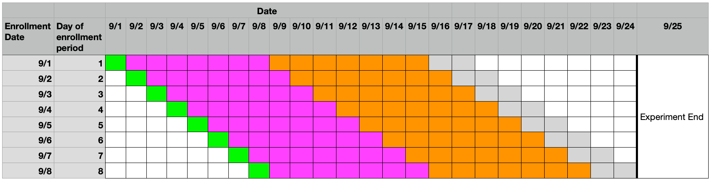

# Configuring your experiment.

From our perspective as experiment owners, experiments are composed of two time periods: the enrollment period and the observation window.

## The Enrollment Period

The enrollment period is the time during which the experiment recipe is live. Clients that sync during this time will see the recipe, and potentially enroll (see [this page on bucketing](../deep-dives/data/bucketing.md) for more details on the enrollment mechanism).

### General considerations

There are a few things that experiment owners should consider when choosing the length of the enrollment period.

- Day-of-week bias. Different types of users use the browser on different days of the week. In order to ensure that the experiment results generalize to the complete population, it's recommended to enroll for units of whole weeks (7 days, 14 days, etc). Failing to do so could lead to results that are overly weighted by one type of user (weekday users, weekend users) such than the actual impact when we launch the treatment to all users might be quite different than the experiment results.
- Partial filling on the first day. Launching experiments mid-day results in one day of partial enrollments, which if not accounted for can mean that the experiment was smaller than intended. Therefore, we generally recommend enrolling for an extra day to account for this.

The exact choice of period length should consider the total volume of the experiment, the audience (namely, new vs existing user), and the business needs.

- Total volume: without increasing the enrollment proportion, larger experiments will need to enroll longer. Of course, in some situations we can increase the enrollment proportion to achieve a shorter enrollment period.
- Audience:
  - Existing user experiments: generally, these experiments see the majority of their enrollments quickly, with enrollment volume rapidly falling off as only users who haven't synced are eligible to continue enrolling. It's not uncommon with an experiment like this to see 90% of the enrollments within the first week and 10% in the later weeks. In this case, it may not be possible to extend the enrollment period to achieve larger sizes so the only option would be increasing the enrollment fraction.
  - New user experiments: generally, these experiments see enrollment volume scaling linearly with period length. Letting these experiments enroll for 2 weeks will see double the enrollments of a 1-week variant.
- Business needs: varying business needs can necessitate varying designs.

### Recommendations

Putting this together, we generally recommend the following possible lengths for enrollment periods:

- 8 days
- 15 days
- 22 days
- etc.

### Getting help

_Please bring questions about enrollment period and sizing either to [Data Science Office Hours](https://mana.mozilla.org/wiki/pages/viewpage.action?spaceKey=DATA&title=Office+Hours) or to [#ask-experimenter](https://mozilla.slack.com/archives/CF94YGE03)_

## The Observation Window

Once a client has enrolled in an experiment, their Observation Window has begun, during which time we can monitor their telemetry and compute metrics. The windows is usually expressed as the number of days since enrollment and _is the same for all clients, regardless of when they enroll_.

The observation window is an abstraction that represents the longest period of time we can observe any individual client for and can be calculated by differencing the enrollment period from the overall runtime for the experiment (observation window = total runtime - enrollment period).

### Relationship with unenrollment and the end of the experiment.

Clients can unenroll from experiments during the middle of the observation window for a variety of reasons (they've disabled Studies, they no longer meet the targeting, opt-ing out of that specific experiment, etc.). To avoid bias, results are calculated over all clients that ever enrolled (unenrolling from the experiment does not remove a client from the analysis). The only situation that _may_ exclude a client from analysis would be opt-ing out of telemetry.

Ending the experiment in Experimenter finalizes the total runtime of the experiment and enables us to determine how long the observation window can be. As a result, for most clients, the observation window ends before they're actually unenrolled from the experiment.

### Visual explanation

The above visual explains how the system works for a hypothetical experiment that launched on 9/1, was ended on 9/25 (lasting a total of 24 days), and had an enrollment period of 8 days. This results in an observation window of 24-8=16 days.

- For clients enrolling on day 1 (9/1), their observation window runs from 9/2 through 9/17.
- For clients enrolling on day 2 (9/2), their observation windows runs from 9/3 through 9/18.
- ...
- For clients enrolling on day 8 (9/8), their observation windows runs from 9/9 through 9/24.

#### Relationship with Analysis Windows

All experiment metrics are calculated over an Analysis Window which is a subset of the Observation Window. Analysis windows can be at a daily, weekly, or overall level. In this example, there are:

- 1 overall window, representing the 16 days after enrollment.
- 2 weekly windows. The first week (indexed as 0 in Jetstream and Partybal) is shown in magenta and the second (1st) week is shown in orange. There wasn't enough days to form a 3rd complete week, so metrics can only be calculated over weeks 0 or 1.
- 16 daily windows.

### Getting help

_Please bring questions about observation windows and analysis to [Data Science Office Hours](https://mana.mozilla.org/wiki/pages/viewpage.action?spaceKey=DATA&title=Office+Hours) or to [#ask-experimenter](https://mozilla.slack.com/archives/CF94YGE03)_
